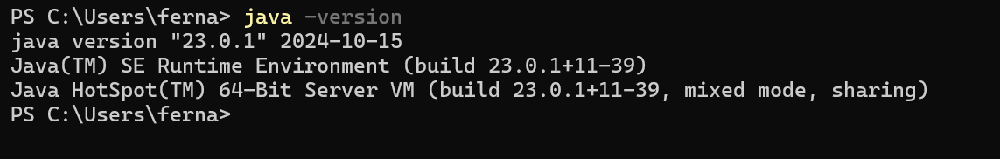
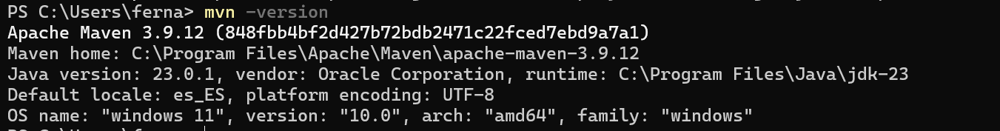
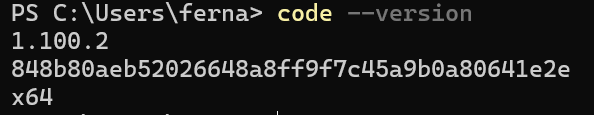
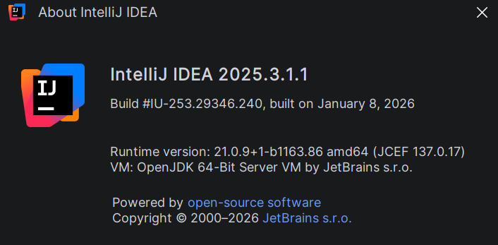

# Práctica 1 - Git
### Programación de Aplicaciones Telemáticas - 3ºB GITT-BA
#### José Manuel Fernández Freige

En este documento se exponen los pasos seguidos para la realización de la primera práctica de la asignatura así como la preparación del entorno de trabajo en el equipo personal.

## Git y GitHub
Para comenzar la práctica se demuestra el conocimiento de Git y sus **comandos básicos**.

Para ello, se hace un **"fork"** del repositorio aportado en el enunciado de la práctica (https://github.com/gitt-3-pat/p1) y se prueban sobre él los comandos básicos:
* git clone
* git status
* git add
* git commit
* git push
* git checkout

### Git clone: 
Sirve para clonar un repositorio del cual se pasa su URL por parámetro. Clonar quiere decir hacer una copia del repositorio remoto al ordenador local o el codespace en el que se está trabajando. 
Realizando el "fork" se está obteniendo una copia en la nube del repositorio "gitt-3-pat/p1" y sobre el que se pueden realizar cambios. Al abrir un codespace para probar los comandos git, Github crea una copia en local sobre la que se podrá trabajar en el repositorio. Esta copia es equivalente a lo que se logra mediante el comando **git clone**.

Por tanto, para pode probar el comando se realiza el clonado del repositorio en un directorio temporal al que se accede mediante el comando `cd /tmp`.
Dentro de este directorio se ejecuta el comando indicado:
`git clone https://github.com/jmfernandezfreige/p1`.

**Log tras la ejecución**:
```bash
Cloning into 'p1'...
remote: Enumerating objects: 26, done.
remote: Counting objects: 100% (10/10), done.
remote: Compressing objects: 100% (10/10), done.
remote: Total 26 (delta 2), reused 0 (delta 0), pack-reused 16 (from 2)
Receiving objects: 100% (26/26), 125.40 KiB | 41.80 MiB/s, done.
Resolving deltas: 100% (2/2), done.
```
Tras el clonado del repositorio correctamente en el directorio temporal y dado que no se necesita para nada más, se borra de esta carpeta temporal el repo clonado con `rm -rf p1`
Finalmente se vuelve a la rama principal del repositorio. 

### Git status:
Sirve para comprobar el estado de la rama actual dentro del repositorio. Git status da tres tipos de información:
* La rama actual
* Cómo de sincronizado está con la copia del repositorio remoto: "X" commits por delante o por detrás.
* Estado de los archivos y cambios: pueden ser nuevos y no añadidos a git (Untracked), modificados sin confirmación (Modified), preparados para confirmar (Staged).

Para probar la distinta información que puede dar el comando, se añade un fichero que queda en el repositorio llamado "git.txt" y que permite también probar el uso de `git add`, `git commit`y `git push`.

**Log ejemplo**:
<ins>Sin cambios:</ins>
```bash
On branch main
Your branch is ahead of 'origin/main' by 1 commit.
  (use "git push" to publish your local commits)

nothing to commit, working tree clean
```
<ins>Archivo nuevo (Untracked):</ins>
```bash
Your branch is up to date with 'origin/main'.

Untracked files:
  (use "git add <file>..." to include in what will be committed)
        git.txt

nothing added to commit but untracked files present (use "git add" to track)
```

<ins>Cambios preparados (tras git add):</ins>
```bash
On branch main
Your branch is up to date with 'origin/main'.

Changes to be committed:
 (use "git restore --staged <file>..." to unstage)
  new file:   git.txt
```

<ins>Cambios confirmados pero no subidos (tras git commit):</ins>
```bash
On branch main
Your branch is ahead of 'origin/main' by 1 commit.
  (use "git push" to publish your local commits)

nothing to commit, working tree clean
```

Como se ha podido demostrar, el comando git status permite conocer la información de la rama actual, los cambios que reconoce y la comparación de versiones entre la rama original y la rama de trabajo.

### Git add:
El comando permite añadir una serie de cambios a una rama de prueba preparándolos para su confirmación y su posterior publicación en el repositorio remoto. Es el paso a la rama de prueba o "staging" en un proyecto.

En el ejemplo empleado con el fichero `git.txt` se puede emplear `git add git.txt` para añadir únicamente el fichero nuevo o `git add .` que añade todos los ficheros nuevos o cambiados en el directorio actual.

Este comando no tiene una salida, pero sí que se muestra una serie de cambios "listos para ser confirmados" como aparece en el segundo ejemplo de log empleado en `git status`.

### Git commit: 
Sirve para confirmar un conjunto de cambios que ya se han preparado y añadido a la rama de Staging.
En el ejemplo, se confirma el cambio realizado al añadir el fichero de prueba.

**Log ejemplo**:
```bash
[main e759df9] añadir git.txt
 1 file changed, 0 insertions(+), 0 deletions(-)
 create mode 100644 git.txt
```

### Git push:
Sirve para subir los cambios confirmados por commits al repositorio remoto.
El comando funciona indicando el **destino** de los cambios confirmados (normalmente "origin", ruta del repositorio en la nube) y el **origen o el objeto** que se "sube" a la rama original (la rama actual "main").
En el ejemplo usado para la práctica, tras confirmar los cambios únicamente falta subirlos al repositorio remoto en GitHub tal y como indica el último ejemplo de log para `git status`: `use "git push" to publish your local commits`

**Log ejemplo**:
```bash
Enumerating objects: 4, done.
Counting objects: 100% (4/4), done.
Delta compression using up to 2 threads
Compressing objects: 100% (2/2), done.
Writing objects: 100% (3/3), 324 bytes | 324.00 KiB/s, done.
Total 3 (delta 0), reused 0 (delta 0), pack-reused 0 (from 0)
To https://github.com/jmfernandezfreige/p1
   bc7f016..e759df9  main -> main
```

### Git checkout: 
Permite el cambio entre ramas para moverse de espacio de trabajo. Además, permite moverse a una rama nueva, creándola y posteriormente situándose en ella (`git checkout -b nueva_rama`).

**Log ejemplo**:
<ins>Tras ejecutar `git checkout -b pruebas`:</ins>
```bash
Switched to a new branch 'pruebas'
```
<ins>Tras regresar a la rama main con `git checkout main`:</ins>
```bash
Switched to branch 'main'
```


## Entorno de desarrollo Java
Se deben instalar en el equipo Java 17 (o posterior), Maven, editor de código fuente (IntelliJ + VSCode). A continuación se muestra la evidencia de tener los distintos programas instalados en el equipo.

#### Java: 


#### Maven:


#### VSCode


#### IntelliJ

